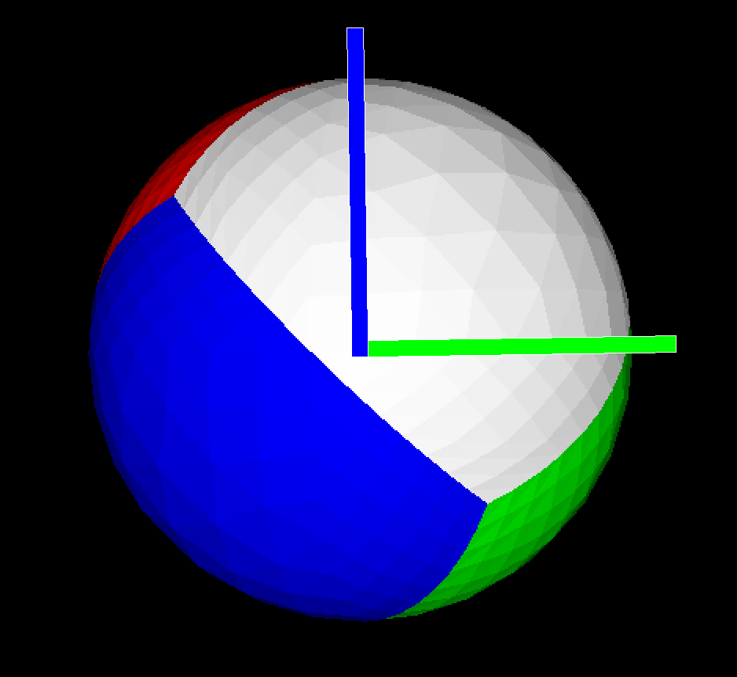
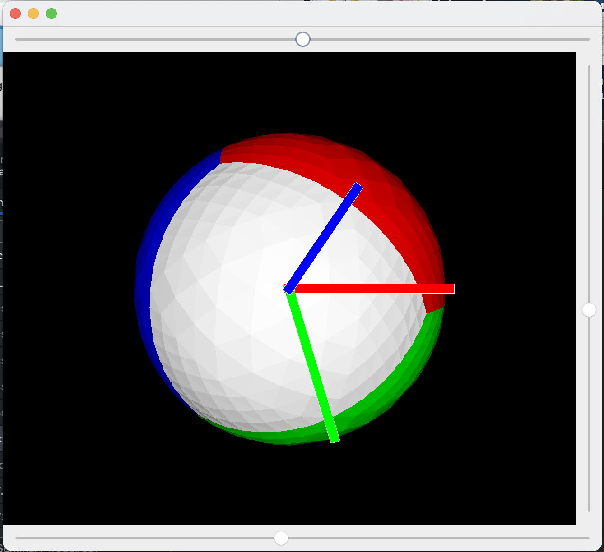

# Пошаговое руководство по созданию простого 3D-рендерера на Java

В данном руководстве мы рассмотрим процесс создания простой программы на Java, которая позволяет отображать 3D-объект (сферу), вращать её по трём осям с помощью слайдеров, а также с помощью мышки. Для удобства изучения будет использоваться библиотека Swing для графического интерфейса и рендеринга.

За основу был взят этот [туториал](http://blog.rogach.org/2015/08/how-to-create-your-own-simple-3d-render.html). Взятый из [списка технологий](https://github.com/codecrafters-io/build-your-own-x?tab=readme-ov-file).

## Предварительная подготовка

### Используемые технологии

* Java SE (Standard Edition)
* Swing (библиотека для создания графического интерфейса)
* Java AWT (для работы с графикой)

### Начало работы

Создадим новый Java-проект в IDE и подготовим необходимые классы (Vertex, Triangle, Matrix3).
*Vertex это точка в 3д пространстве*
```java
class Vertex {
    double x;
    double y;
    double z;
    Vertex(double x, double y, double z) {
        this.x = x;
        this.y = y;
        this.z = z;
    }
}
```

*Triangle это полигон, который составляет 3д объект, сотостоящий из трех Vertex-ей*
```java
class Triangle {
    Vertex v1;
    Vertex v2;
    Vertex v3;
    Color color;
    Triangle(Vertex v1, Vertex v2, Vertex v3, Color color) {
        this.v1 = v1;
        this.v2 = v2;
        this.v3 = v3;
        this.color = color;
    }
}
```

*Matrix3 это класс, предназначенный для работы с матрицами размером 3x3, которые используются для преобразования точек (вершин) в трёхмерном пространстве. С его помощью можно выполнять операции поворота, масштабирования и других линейных преобразований в 3D-графике..*

Класс содержит два основных метода:

 * multiply(Matrix3 other) — метод для перемножения двух матриц. Используется для последовательного применения нескольких преобразований.

* transform(Vertex in) — метод, который применяет текущее матричное преобразование к вершине (Vertex) и возвращает новую вершину с изменёнными координатами.

```java
class Matrix3 {
    double[] values;
    Matrix3(double[] values) {
        this.values = values;
    }
    Matrix3 multiply(Matrix3 other) {
        double[] result = new double[9];
        for (int row = 0; row < 3; row++) {
            for (int col = 0; col < 3; col++) {
                for (int i = 0; i < 3; i++) {
                    result[row * 3 + col] +=
                            this.values[row * 3 + i] * other.values[i * 3 + col];
                }
            }
        }
        return new Matrix3(result);
    }
    Vertex transform(Vertex in) {
        return new Vertex(
                in.x * values[0] + in.y * values[3] + in.z * values[6],
                in.x * values[1] + in.y * values[4] + in.z * values[7],
                in.x * values[2] + in.y * values[5] + in.z * values[8]
        );
    }
}
```

## Шаг 1. Создание основного окна

Создадим окно приложения с помощью Swing:

```java
JFrame frame = new JFrame();
Container pane = frame.getContentPane();
pane.setLayout(new BorderLayout());
frame.setSize(400, 400);
frame.setVisible(true);
```

## Шаг 2. Добавление слайдеров

Добавим слайдеры для управления вращением объекта по горизонтальной (heading), вертикальной (pitch):

```java
JSlider headingSlider = new JSlider(SwingConstants.HORIZONTAL,-360, 360, 0);
pane.add(headingSlider, BorderLayout.SOUTH);

JSlider pitchSlider = new JSlider(SwingConstants.VERTICAL, -360, 360, 0);
pane.add(pitchSlider, BorderLayout.EAST);
```

## Шаг 3. Создание панели рендеринга

Создадим панель для рендеринга, используя анонимный класс и переопределив метод `paintComponent()`:

```java
JPanel renderPanel = new JPanel() {
    public void paintComponent(Graphics g) {
        Graphics2D g2 = (Graphics2D) g;
        g2.setColor(Color.BLACK);
        g2.fillRect(0, 0, getWidth(), getHeight());
        // Рендеринг будет здесь
    }
};
pane.add(renderPanel, BorderLayout.CENTER);
```

## Шаг 4. Добавление модели объекта (сфера)

Создадим модель сферы из треугольников:

```java
List<Triangle> tris = new ArrayList<>();
tris.add(new Triangle(new Vertex(100, 100, 100),
        new Vertex(-100, -100, 100),
        new Vertex(-100, 100, -100),
        Color.WHITE));
tris.add(new Triangle(new Vertex(100, 100, 100),
        new Vertex(-100, -100, 100),
        new Vertex(100, -100, -100),
        Color.RED));
tris.add(new Triangle(new Vertex(-100, 100, -100),
        new Vertex(100, -100, -100),
        new Vertex(100, 100, 100),
        Color.GREEN));
tris.add(new Triangle(new Vertex(-100, 100, -100),
        new Vertex(100, -100, -100),
        new Vertex(-100, -100, 100),
        Color.BLUE));
```

Но сейчас, это не будет похоже на сферу:


Поэтому реализуем метод сглаживания наших треугольников:
###Метод `inflate` для детализации модели (subdivision)
```java
public static List<Triangle> inflate(List<Triangle> tris) {
List<Triangle> result = new ArrayList<>();
for (Triangle t : tris) {
    Vertex m1 = new Vertex((t.v1.x + t.v2.x)/2, (t.v1.y + t.v2.y)/2, (t.v1.z + t.v2.z)/2);
    Vertex m2 = new Vertex((t.v2.x + t.v3.x)/2, (t.v2.y + t.v3.y)/2, (t.v2.z + t.v3.z)/2);
    Vertex m3 = new Vertex((t.v1.x + t.v3.x)/2, (t.v1.y + t.v3.y)/2, (t.v1.z + t.v3.z)/2);
    result.add(new Triangle(t.v1, m1, m3, t.color));
    result.add(new Triangle(t.v2, m1, m2, t.color));
    result.add(new Triangle(t.v3, m2, m3, t.color));
    result.add(new Triangle(m1, m2, m3, t.color));
}
for (Triangle t : result) {
    for (Vertex v : new Vertex[] { t.v1, t.v2, t.v3 }) {
        double l = Math.sqrt(v.x * v.x + v.y * v.y + v.z * v.z) / Math.sqrt(30000);
        v.x /= l;
        v.y /= l;
        v.z /= l;
    }
}
return result;
    }
```

Метод `inflate` предназначен для **детализации модели (subdivision)** — он разбивает существующие треугольники на более мелкие, тем самым увеличивая детализацию и качество отображения 3D-объекта (например, сферы).

Как работает метод:

1. Разбиение треугольников:

- Для каждого треугольника из списка исходных (`tris`) вычисляются середины каждой из его сторон (`m1`, `m2`, `m3`).
- Один исходный треугольник заменяется четырьмя новыми треугольниками:
  - Три внешних треугольника, которые соединяют исходные вершины с новыми серединными точками.
  - Один внутренний треугольник, образованный новыми точками середин сторон.

2. Нормализация вершин:

- После разбиения координаты всех новых вершин нормализуются так, чтобы они лежали на поверхности сферы.

Таким образом, метод позволяет постепенно сглаживать объект.


## Шаг 5. Матрицы поворота

Создадим матрицы вращения для каждой оси:

```java
double heading = Math.toRadians(headingSlider.getValue());
Matrix3 headingTransform = new Matrix3(new double[] {
        Math.cos(heading), 0, Math.sin(heading),
        0, 1, 0,
        -Math.sin(heading), 0, Math.cos(heading)
});
double pitch = Math.toRadians(pitchSlider.getValue());
Matrix3 pitchTransform = new Matrix3(new double[] {
        1, 0, 0,
        0, Math.cos(pitch), -Math.sin(pitch),
        0, Math.sin(pitch), Math.cos(pitch)
});
```

и получим матрицу поворота

```java
Matrix3 transform = pitchTransform.multiply(headingTransform);
```

## Шаг 6. Рендеринг и буфер глубины

Реализуем отображение объекта с учетом глубины:


### Создание изображения и Z-буфера

```java
BufferedImage img = new BufferedImage(getWidth(), getHeight(), BufferedImage.TYPE_INT_ARGB);
double[] zBuffer = new double[img.getWidth() * img.getHeight()];
for (int q = 0; q < zBuffer.length; q++) {
    zBuffer[q] = Double.NEGATIVE_INFINITY;
}
```
Создаётся изображение и Z-буфер для хранения глубины каждого пикселя. Инициализация значениями `-∞` позволяет корректно работать с ближними объектами.

### Цикл по всем треугольникам

```java
for (Triangle t : tris) {
```
Обрабатываются все треугольники модели.

### Трансформация и центрирование вершин

```java
Vertex v1 = transform.transform(t.v1);
v1.x += getWidth() / 2;
v1.y += getHeight() / 2;
// Аналогично для v2 и v3
```
Вершины трансформируются (поворот, масштаб и пр.) и смещаются в центр экрана.

### Вычисление нормали треугольника

```java
Vertex ab = new Vertex(v2.x - v1.x, v2.y - v1.y, v2.z - v1.z);
Vertex ac = new Vertex(v3.x - v1.x, v3.y - v1.y, v3.z - v1.z);
Vertex norm = new Vertex(
    ab.y * ac.z - ab.z * ac.y,
    ab.z * ac.x - ab.x * ac.z,
    ab.x * ac.y - ab.y * ac.x
);
double normalLength = Math.sqrt(norm.x * norm.x + norm.y * norm.y + norm.z * norm.z);
norm.x /= normalLength;
norm.y /= normalLength;
norm.z /= normalLength;
double angleCos = Math.abs(norm.z);
```
Рассчитывается нормаль треугольника и приближённое освещение по оси Z.

### Определение границ треугольника

```java
int minX = (int) Math.max(0, Math.ceil(Math.min(v1.x, Math.min(v2.x, v3.x))));
int maxX = (int) Math.min(img.getWidth() - 1, Math.floor(Math.max(v1.x, Math.max(v2.x, v3.x))));
int minY = (int) Math.max(0, Math.ceil(Math.min(v1.y, Math.min(v2.y, v3.y))));
int maxY = (int) Math.min(img.getHeight() - 1, Math.floor(Math.max(v1.y, Math.max(v2.y, v3.y))));
```
Находятся границы прямоугольника, в который вписан треугольник.

### Вычисление площади треугольника

```java
double triangleArea = (v1.y - v3.y) * (v2.x - v3.x) + (v2.y - v3.y) * (v3.x - v1.x);
```
Используется для расчёта барицентрических координат.

### Перебор пикселей и барицентрические координаты

```java
for (int y = minY; y <= maxY; y++) {
    for (int x = minX; x <= maxX; x++) {
        double b1 = ((y - v3.y) * (v2.x - v3.x) + (v2.y - v3.y) * (v3.x - x)) / triangleArea;
        double b2 = ((y - v1.y) * (v3.x - v1.x) + (v3.y - v1.y) * (v1.x - x)) / triangleArea;
        double b3 = ((y - v2.y) * (v1.x - v2.x) + (v1.y - v2.y) * (v2.x - x)) / triangleArea;
```
Барицентрические координаты определяют, находится ли пиксель внутри треугольника.

### Z-буфер и отрисовка пикселя

```java
        if (b1 >= 0 && b1 <= 1 && b2 >= 0 && b2 <= 1 && b3 >= 0 && b3 <= 1) {
            double depth = b1 * v1.z + b2 * v2.z + b3 * v3.z;
            int zIndex = y * img.getWidth() + x;
            if (zBuffer[zIndex] < depth) {
                img.setRGB(x, y, getShade(t.color, angleCos).getRGB());
                zBuffer[zIndex] = depth;
            }
        }
    }
}
```
Если пиксель ближе к камере, чем предыдущий, он отрисовывается, и его глубина сохраняется в `zBuffer`.


В итоге получаем такой код, который отрисовывает все пиксели которые попали на треуголники с учетом глубины:

```java
BufferedImage img = new BufferedImage(getWidth(), getHeight(), BufferedImage.TYPE_INT_ARGB);

double[] zBuffer = new double[img.getWidth() * img.getHeight()];
for (int q = 0; q < zBuffer.length; q++) {
    zBuffer[q] = Double.NEGATIVE_INFINITY;
}

for (Triangle t : tris) {
    Vertex v1 = transform.transform(t.v1);
    v1.x += getWidth() / 2;
    v1.y += getHeight() / 2;
    Vertex v2 = transform.transform(t.v2);
    v2.x += getWidth() / 2;
    v2.y += getHeight() / 2;
    Vertex v3 = transform.transform(t.v3);
    v3.x += getWidth() / 2;
    v3.y += getHeight() / 2;

    Vertex ab = new Vertex(v2.x - v1.x, v2.y - v1.y, v2.z - v1.z);
    Vertex ac = new Vertex(v3.x - v1.x, v3.y - v1.y, v3.z - v1.z);
    Vertex norm = new Vertex(
            ab.y * ac.z - ab.z * ac.y,
            ab.z * ac.x - ab.x * ac.z,
            ab.x * ac.y - ab.y * ac.x
    );
    double normalLength = Math.sqrt(norm.x * norm.x + norm.y * norm.y + norm.z * norm.z);
    norm.x /= normalLength;
    norm.y /= normalLength;
    norm.z /= normalLength;

    double angleCos = Math.abs(norm.z);

    int minX = (int) Math.max(0, Math.ceil(Math.min(v1.x, Math.min(v2.x, v3.x))));
    int maxX = (int) Math.min(img.getWidth() - 1, Math.floor(Math.max(v1.x, Math.max(v2.x, v3.x))));
    int minY = (int) Math.max(0, Math.ceil(Math.min(v1.y, Math.min(v2.y, v3.y))));
    int maxY = (int) Math.min(img.getHeight() - 1, Math.floor(Math.max(v1.y, Math.max(v2.y, v3.y))));

    double triangleArea = (v1.y - v3.y) * (v2.x - v3.x) + (v2.y - v3.y) * (v3.x - v1.x);

    for (int y = minY; y <= maxY; y++) {
        for (int x = minX; x <= maxX; x++) {
            double b1 = ((y - v3.y) * (v2.x - v3.x) + (v2.y - v3.y) * (v3.x - x)) / triangleArea;
            double b2 = ((y - v1.y) * (v3.x - v1.x) + (v3.y - v1.y) * (v1.x - x)) / triangleArea;
            double b3 = ((y - v2.y) * (v1.x - v2.x) + (v1.y - v2.y) * (v2.x - x)) / triangleArea;
            if (b1 >= 0 && b1 <= 1 && b2 >= 0 && b2 <= 1 && b3 >= 0 && b3 <= 1) {
                double depth = b1 * v1.z + b2 * v2.z + b3 * v3.z;
                int zIndex = y * img.getWidth() + x;
                if (zBuffer[zIndex] < depth) {
                    img.setRGB(x, y, getShade(t.color, angleCos).getRGB());
                    zBuffer[zIndex] = depth;
                }
            }
        }
    }
}
```

## Шаг 7. Финал

Добавляем слайдерам вызов на отрисовку при изменения значения:
``` java
headingSlider.addChangeListener(e -> renderPanel.repaint());
pitchSlider.addChangeListener(e -> renderPanel.repaint());
```

Задаем размер окну и отображаем его:
``` java
frame.setSize(400, 400);
frame.setVisible(true);
```

# Модификация проекта

* Добавлена третья ось вращения (Z-ось).
* Возможность вращения мышкой.
* Отображение локальных осей на объекте.

## Ось вращения Z

В оригенальном проекте не хватало еще одной оси вращения, поэтому я ее решил добавить.
Для этого нам надо добавить еще одну матрицу вращения:

```java
double roll = Math.toRadians(rollSlider.getValue());
Matrix3 rollTransform = new Matrix3(new double[] {
        Math.cos(roll), -Math.sin(roll), 0,
        Math.sin(roll), Math.cos(roll), 0,
        0, 0, 1
});
```
Тогда матрица поворотов станет:
```java
Matrix3 transform = pitchTransform.multiply(headingTransform).multiply(rollTransform);
```
Так же добавим соответсвующий слайдер и вызов им отрисовки:
```java
// slider to control roll (z rotation)
JSlider rollSlider = new JSlider(SwingConstants.HORIZONTAL, -360, 360, 0);
pane.add(rollSlider, BorderLayout.NORTH);

...


rollSlider.addChangeListener(e -> renderPanel.repaint());        
```
## Вращение мышкой
Я подумал было бы удобно вместо слайлеров вращать объект мышкой, поэтому решил его добавить.
```java
final Point lastMouse = new Point();
renderPanel.addMouseListener(new java.awt.event.MouseAdapter() {
    public void mousePressed(java.awt.event.MouseEvent e) {
        lastMouse.setLocation(e.getPoint());
    }
});

renderPanel.addMouseMotionListener(new java.awt.event.MouseMotionAdapter() {
    public void mouseDragged(java.awt.event.MouseEvent e) {
        int dx = e.getX() - lastMouse.x;
        int dy = e.getY() - lastMouse.y;

        int head = headingSlider.getValue() + dx;
        int pitch = pitchSlider.getValue() + dy;
        headingSlider.setValue((head > 0? 1: -1) * (Math.abs(head)%360));
        pitchSlider.setValue((pitch > 0? 1: -1) * (Math.abs(pitch)%360));

        lastMouse.setLocation(e.getPoint());
    }
});
```
Сначала мы запоинаем позицию курсора на `renderPanel` при нажатии, а при движении вычисляем дельту по `X` и по `Y` координатам, от начала.
Затем мы обрезаем значение вращения, если оно больше 360 или меньше -360, для каждой оси.
Таким образом `370º => 10º`, а `-600º => -240º`.
Задаем полученное значение слайдерам, тем самым вызывая отрисовку.

## Отображение локальных осей на объекте

Чтобы вращени нашего объекта было проще понять, было решено добавить отображение осей, как это деалеться в большенстве 3D движков.

Для этого я создал метод который будет отрисовывать линию в пространстве, у которой будет белая обводка.

```java
public static void drawLineWithBorders(Graphics2D g, Color color, int startX, int startY, int endX, int endY, int width, int border)
{
    g.setStroke(new BasicStroke(width + border));
    g.setColor(Color.WHITE);
    g.drawLine(startX, startY, endX, endY);
    g.setStroke(new BasicStroke(width));
    g.setColor(color);
    g.drawLine(startX, startY, endX, endY);
}
```
Начло линии в координатах (`startX`, `startY`), а конец (`endX`, `endY`).
Сначала отрисовываеться белая полоска, а поверх нее уже цветная.

С помощью этого метода добовляем этот код, после отрисовки наших треуголников, чтобы они были всехгда поверх объекта:
```java
 int cx = getWidth() / 2;
int cy = getHeight() / 2;

int axisLength = 200;

Vertex xAxisEnd = transform.transform(new Vertex(axisLength, 0, 0));
Vertex yAxisEnd = transform.transform(new Vertex(0, axisLength, 0));
Vertex zAxisEnd = transform.transform(new Vertex(0, 0, axisLength));

int x1 = cx + (int)xAxisEnd.x;
int y1 = cy + (int)xAxisEnd.y;

int x2 = cx + (int)yAxisEnd.x;
int y2 = cy + (int)yAxisEnd.y;

int x3 = cx + (int)zAxisEnd.x;
int y3 = cy + (int)zAxisEnd.y;

drawLineWithBorders(g2, Color.RED, cx, cy, x1, y1, 10, 1);
drawLineWithBorders(g2, Color.GREEN, cx, cy, x2, y2, 10, 1);
drawLineWithBorders(g2, Color.BLUE, cx, cy, x3, y3, 10, 1);
```

Сначала получаем середину нашего экрана, задаем длину векторам, и создаем сами векторы, центруем их (переводим в глобальную систему координат) и отрисовываем нашим методом.

# Итого

Мы создали приложение которое отрисовывает шар, с возможностью его вращения.
Благодоря проекту, я изучил способы проецирования 3д моделей на экран и узнал о матрицах трансформирования, которые можно использовать для любых преобразований (таких как поворот или маштабирование).


