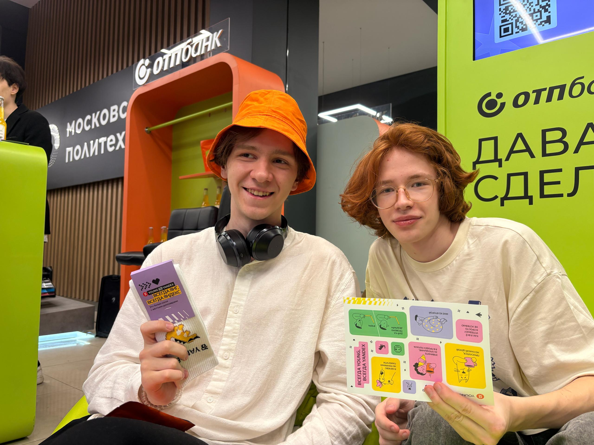
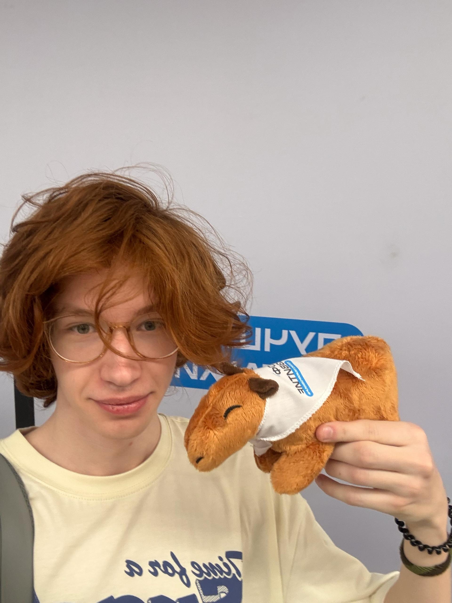
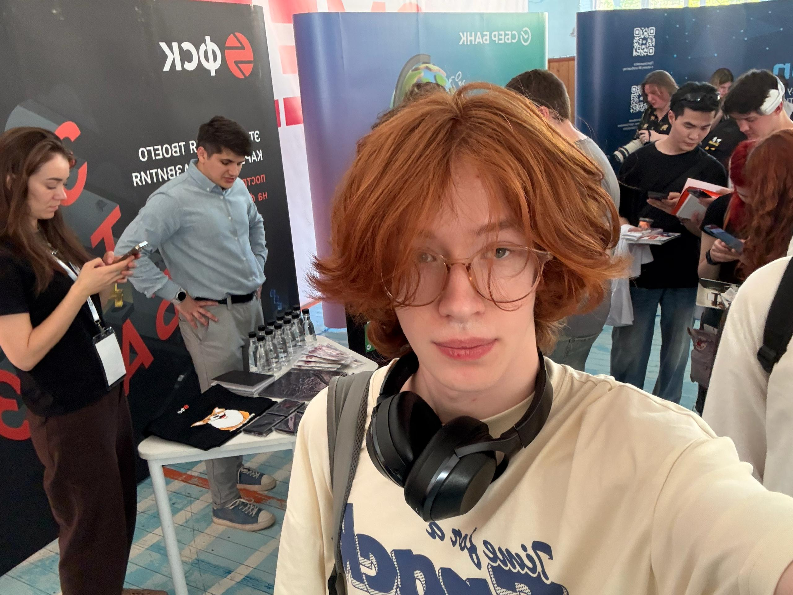
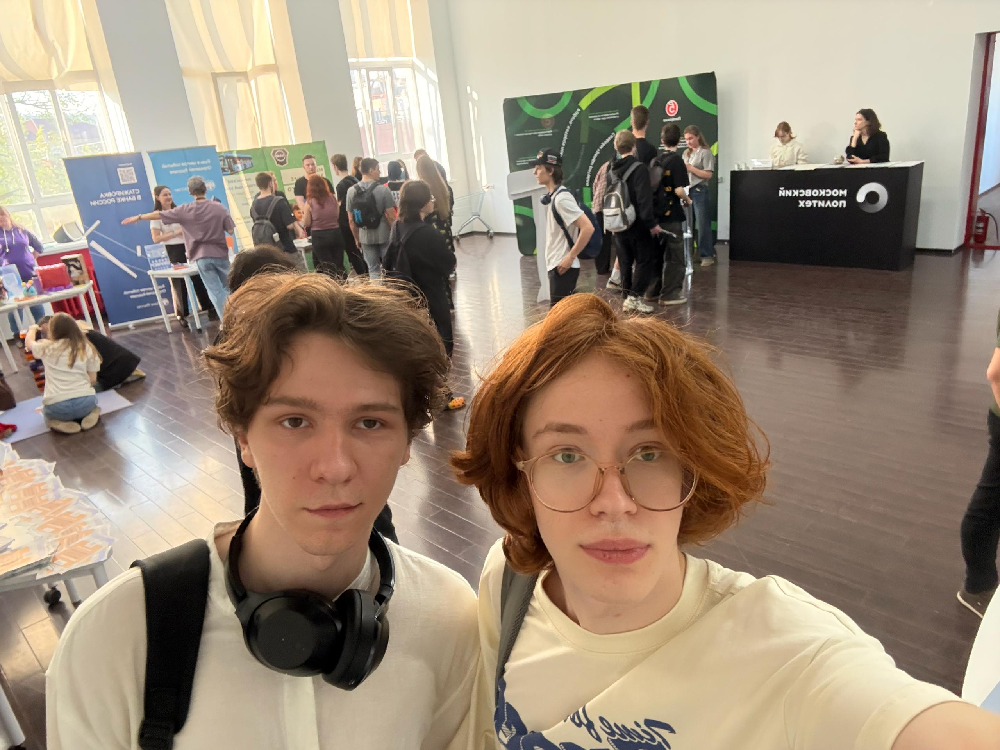

# Отчёт о взаимодействии с организацией-партнёром

## Мероприятие: Карьерный марафон в Московском Политехе  
**Дата участия:** 22 апреля 2025 г. 
**Формат:** очное участие  
**Время взаимодействия:** ~4 часа  

## Цель участия

Принять участие в карьерном марафоне, чтобы:
- познакомиться с индустриальными компаниями-партнёрами Московского Политеха;
- выяснить актуальные требования к начинающим разработчикам;
- получить консультации по востребованности технологий, применяемых в проекте INVADE;
- задать вопросы о стажировках и карьерном росте в смежных IT-направлениях.

## Что было сделано

Во время мероприятия я:

- Общался с HR-специалистами и представителями более чем 10 компаний;
- Уточнил особенности составления резюме и рекомендации для начинающих разработчиков;
- Пообщался с рекрутёрами по поводу востребованности **Unity** и **игровых технологий**;
- Задал вопрос о применимости **геймификации** в неигровых продуктах — банковских сервисах, образовательных платформах, UX-интерфейсах;
- Подал заявки на стажировки и подписался на соцсети компаний для отслеживания новостей и открытых позиций;
- Принял участие в активностях и получил мерч, включая пауэрбанк и канцелярию.

## Полученные знания

- Несмотря на то, что игровых компаний на марафоне почти не было, многие участники отметили, что **геймификация** — активный тренд, и Unity часто используется не только в играх, но и в интерфейсных решениях, презентациях, VR/AR и симуляторах.
- Подтвердилось, что знание C# и опыт в Unity может быть полезным не только в геймдеве, но и в смежных областях.
- HR-специалисты рассказали, что личные проекты и участие в хакатонах — весомый плюс для портфолио, особенно при отсутствии коммерческого опыта.

## Связь с проектом INVADE

Мероприятие позволило посмотреть на наш проект **INVADE** шире:  
- Даже если проект не попадёт в классический геймдев, он может быть отличным **показателем навыков** в Unity, 3D-моделировании, работе с пользовательским сценарием и интерфейсами — что важно для найма в IT-компании с элементами геймификации.
- Полученные рекомендации о подаче проекта в резюме и на собеседованиях помогут лучше структурировать питч и оформить его для презентаций.
- Также мероприятие подтвердило, что **игровое мышление** и визуальный интерактив становятся востребованными за пределами индустрии развлечений — и наш проект вполне может использоваться как **портфолио-продукт** и демонстрация мультидисциплинарного опыта.

## Вывод

Карьерный марафон дал важное понимание роли игровых технологий в современной IT-среде.  
Обсуждение Unity и геймификации показало, что даже студенческий проект как INVADE может быть ценен не только как игра, но и как **демонстрация универсальных цифровых навыков**.  
Участие в подобных мероприятиях помогает не только строить карьерные связи, но и видеть потенциальные применения проекта вне академической среды.

|Фотографии||
|:-:|:-:|
|||
|||
