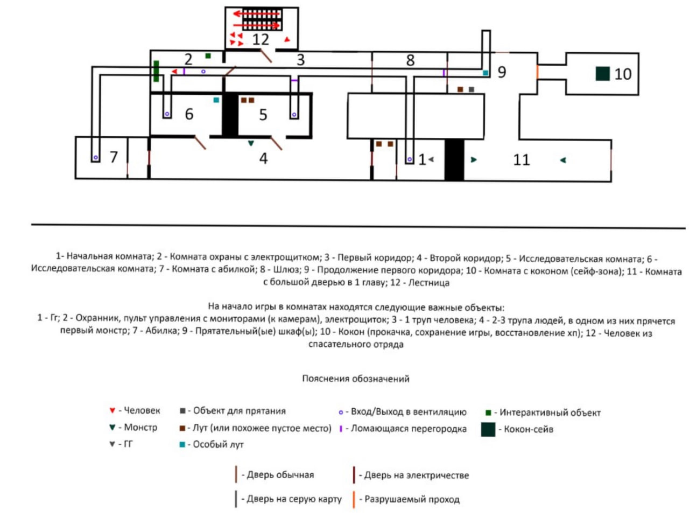
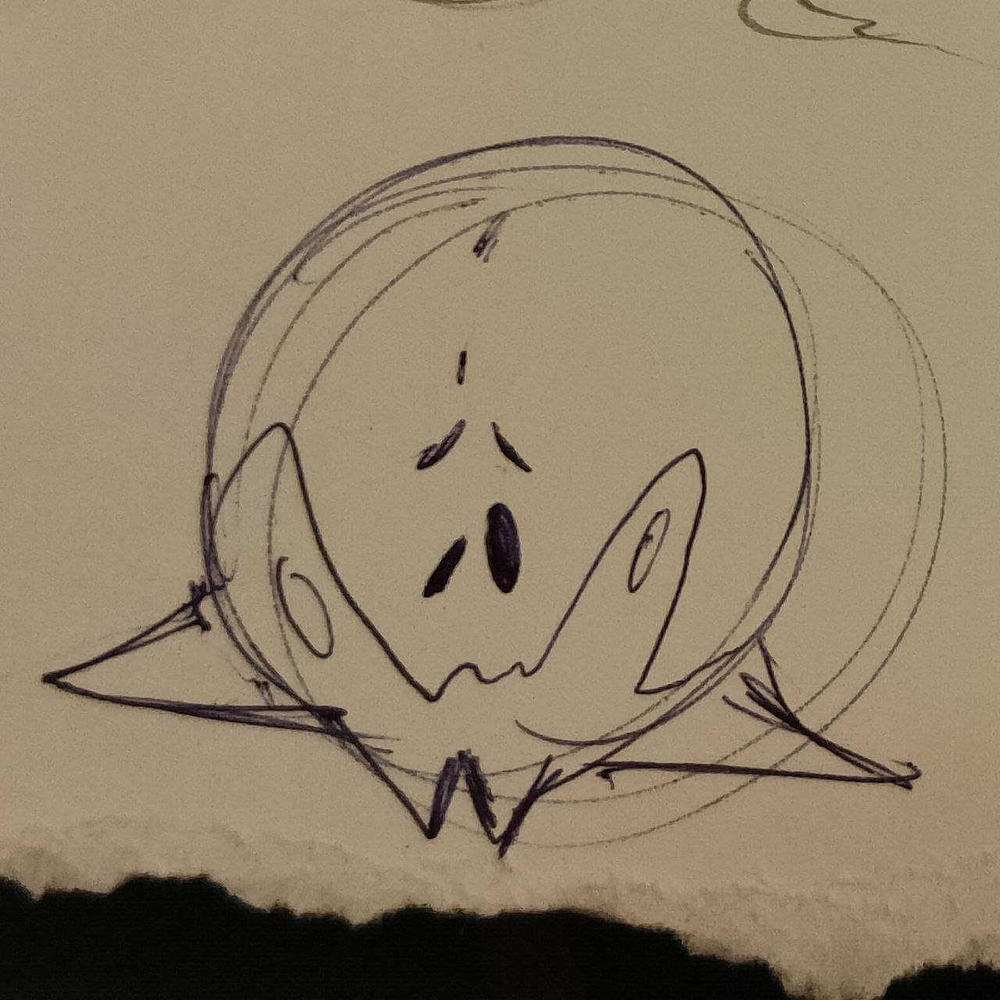
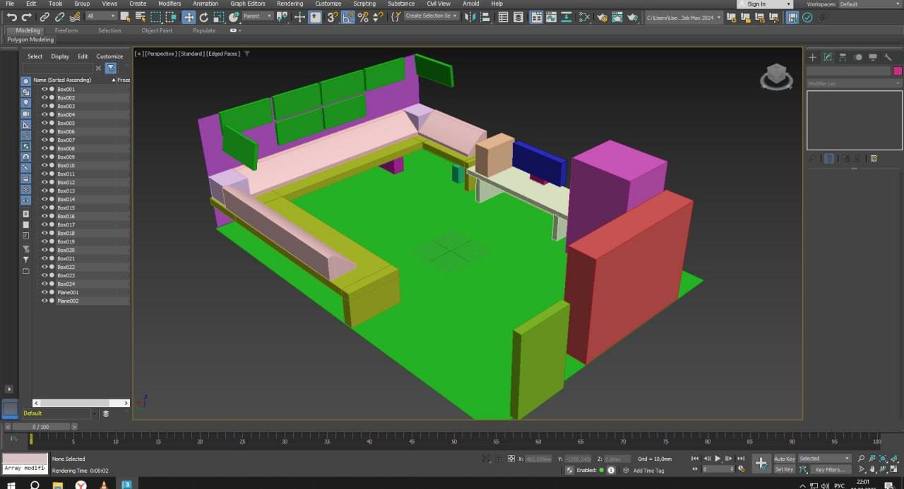
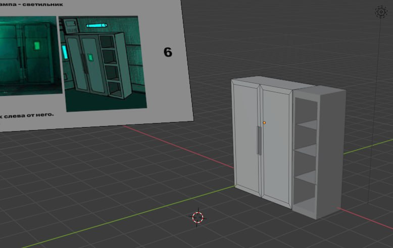
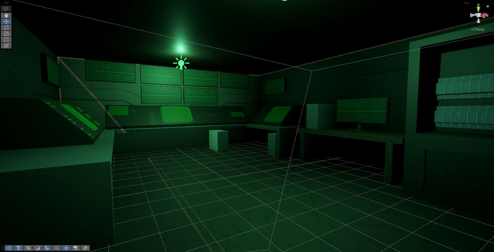
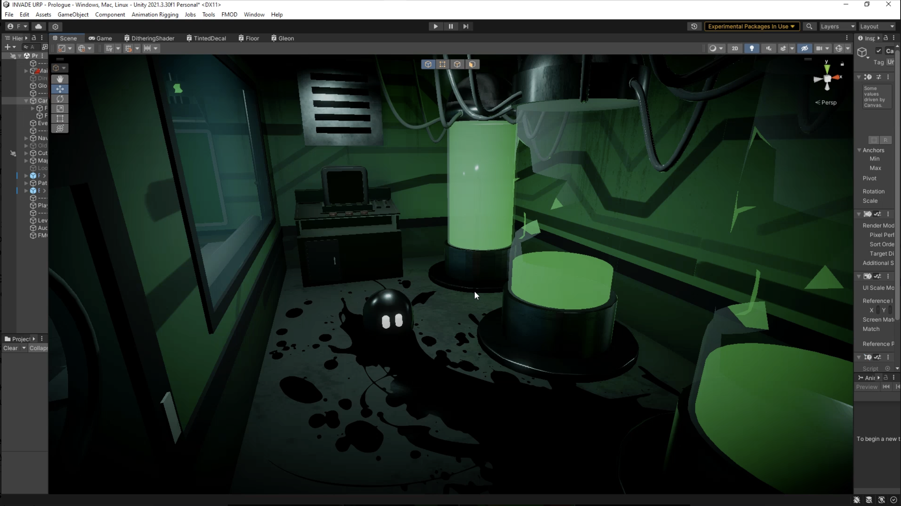

# Журнал разработки

## 🖌️ Создание концепта

Мы начали работу над **INVADE** с формирования визуального ядра проекта.  
В первую очередь определились с ключевыми ассоциациями — биомеханика, разрушенный sci-fi, органическая угроза.  
Были созданы первые концепты главного героя (Экси), лабораторных локаций и противников, вдохновлённые тенью от *Alien*, атмосферой *Hollow Knight* и нестандартными формами паразитических существ.

Также разработали базовую цветовую палитру: приглушённые металлические тона, неестественное биолюминесцентное освещение и контрастные вспышки чёрного и зелёного.  
Это стало фундаментом для дальнейшей 3D-визуализации.
|:-:|:-:|
|||

---

## 🔧 3D-моделирование

После утверждения артов мы приступили к созданию 3D-моделей.  
Для этого использовались *Blender* и *Unity* — мы начали с окружения: двери, панели управления, лабораторные модули.  
Первая тестовая сцена включала в себя коридор, запертую капсулу и вентиляционный тоннель.
|:-:|:-:|
|||

---

## 🧪 Прототипирование

Мы собрали базовый прототип на Unity: добавили движение и врагов.  
Появилась первая игровая зона — стартовая камера.

На данном этапе реализованы базовые механики: перемещение, использование вентиляции, открытие дверей, простая ИИ-логика противников и начало системы способностей.  
Сейчас активно тестируем поведение врагов и подготавливаем переход к следующей игровой зоне.
|:-:|:-:|
|||
